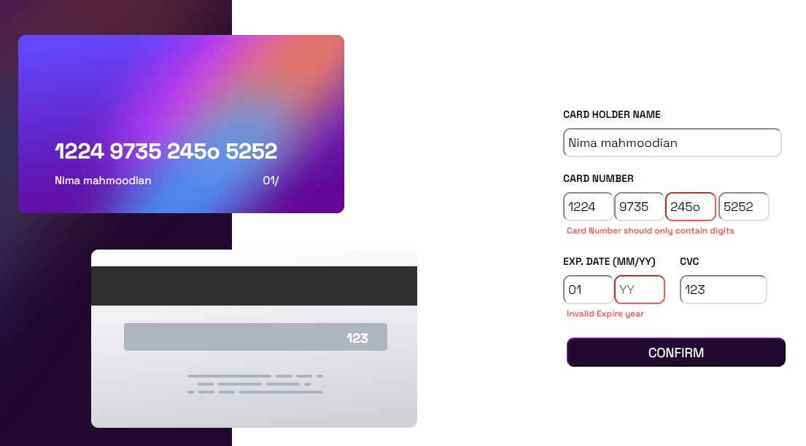

# Interactive card details
## Overview
This is a solution to the [Interactive card details form challenge on Frontend Mentor](https://www.frontendmentor.io/challenges/interactive-card-details-form-XpS8cKZDWw).
### The challenge
Users should be able to:
- Fill in the form and see the card details update in real time
- Receive error messages when the form is submitted if:
  - Any input field is empty
  - The card number, expiry date, or CVC fields are in the wrong format
- View the optimal layout depending on their device's screen size
- See hover, active, and focus states for interactive elements on the page

### Screenshot

### Links
You visit this link to play around with this component:)
- Solution URL: https://esnima.github.io/Interactive-card-design/

## My process

### Built with
- React.js
- SASS
- Flexbox
- Semantic HTML5 markup

### What I learned
I practiced and learned tons of new things. I learned how to use the useEffect hook, how to manage states, and how to perform conditional rendering. 
I also practiced with CSS animations and how to create a responsive web design.

### Continued development
Adding redux as the state manager can be a good goal for further development. 

## Author
Nima Mahmoodian
LinkedIn:

